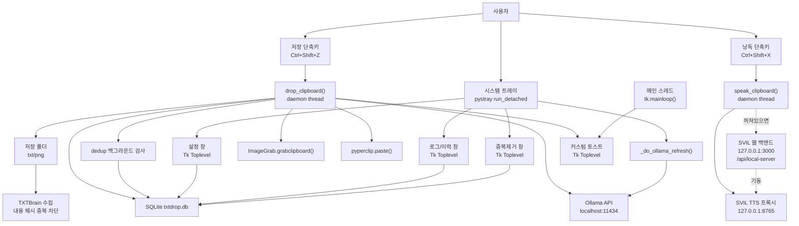

# TXTDrop 아키텍처

기준 문서: 기능명세.md / 작성자: Claude Code / 작성일: 2026-07-10 / 기준 버전: v0.7

## 01. 개요

TXTDrop은 단일 Windows 데스크톱 프로세스 안에서 트레이, 전역 단축키, Tkinter UI, SQLite 저장소, Ollama·SVIL TTS HTTP API를 연결한다. 앱 자체 백엔드는 없으며, Ollama는 로컬 서버 `http://localhost:11434`, SVIL TTS는 로컬 프록시 `http://127.0.0.1:8765`를 사용한다. TTS 프록시가 꺼져 있으면 SVIL 웹 백엔드 `http://127.0.0.1:3000`을 통해 자동 기동을 요청한다. 저장 폴더의 `.txt`는 연계 앱 TXTBrain이 수집한다.

## 02. 구성도

## 03. 스레드 모델

| 스레드 | 역할 |
|--------|------|
| OS 메인 스레드 | `tk.Tk().mainloop()` — 모든 Tk UI 이벤트 처리 |
| pystray 백그라운드 | `tray.run_detached()` — 트레이 아이콘/알림 |
| keyboard 내부 | 전역 단축키 훅 (논데몬 스레드 포함) |
| daemon threads | `drop_clipboard`, `speak_clipboard`(TTS 자동 기동 폴링 포함), dedup 검사, Ollama 확인/제목 생성, 사운드 |

**핵심 규칙:** Tkinter `mainloop()`는 반드시 OS 메인 스레드에서 실행한다. UI 작업은 `tk_root.call_on_main()`으로 스케줄링한다.

## 04. 프론트엔드

* UI 프레임워크는 Tkinter다.
* `tk_root.py`가 숨겨진 공유 root를 만든다.
* `settings_window.py`, `log_window.py`, `dedup_window.py`, `notify.py`는 모두 `Toplevel`을 사용한다.
* 트레이 메뉴는 pystray의 Windows 알림 핸들러를 패치해 다크 메뉴를 띄우고, 실패 시 기본 메뉴로 폴백한다.
* 토스트는 Windows `SPI_GETWORKAREA` API로 작업 표시줄 위에 위치한다.

## 05. 백엔드 / 외부 연동

* 앱 자체 백엔드는 없다.
* Ollama 연동은 `urllib.request`로 `/api/tags`, `/api/generate`를 호출한다. 상태 캐시는 10초 TTL, 설정 창에서는 `is_running()` 실시간 확인.
* SVIL TTS 연동은 `tts_client.py`가 `POST /api/tts/pipeline`을 호출한다 (`narration`, `play_async`). **서버 미기동 시 SVIL 웹 백엔드(`http://127.0.0.1:3000/api/local-server`, `action:start, id:tts`)로 자동 기동을 요청하고 최대 60초 헬스체크 폴링 후 재시도한다** (2026-07-10, MCP `svil_tts_speak`과 동일 경로).
* TXTBrain 연계: TXTDrop은 파일만 저장하고 코드 직접 호출은 없다. TXTBrain이 저장 폴더를 수집하며 내용 해시로 중복을 차단한다.

## 06. 데이터 저장소

* SQLite DB는 `txtdrop.db`다.
* PyInstaller 실행 시 실행 파일 폴더, 소스 실행 시 프로젝트 폴더에 위치한다.
* 설정값은 메모리 캐시(`_cache`)로 읽기 성능을 최적화한다.
* 로그는 시작 시 30일 초과 항목을 정리한다.
* 중복제거는 `history` row를 `trash` 테이블로 이동하며(복구 가능), 저장 파일은 건드리지 않는다.

## 07. 인증 / 권한

* 앱 내부 인증은 없다.
* 전역 단축키 등록은 Windows 훅 권한과 환경에 영향을 받는다.
* 저장 폴더는 사용자가 선택한 로컬 경로를 사용한다.
* `/api/local-server` 자동 기동 호출은 인증이 필요 없는 로컬 전용 엔드포인트다.

## 08. 배포 / 운영

* PyInstaller spec은 **onedir** 구조를 사용한다 (`dist\TXTDrop\`).
* `build.bat`은 아이콘 생성, PyInstaller 빌드, Inno Setup 설치 파일 생성을 순서대로 실행한다.
* Inno Setup: `CloseApplications=yes`로 설치 시 실행 중 프로세스 자동 종료 시도, `startup` 태스크로 Windows 시작 시 자동 실행 등록.
* 앱 종료: `os._exit(0)` — `keyboard` 논데몬 스레드 포함 즉시 프로세스 종료.

## 09. 알려진 제약

* 절전/복귀 `WM_POWERBROADCAST` WNDPROC 패치는 PyInstaller frozen 런타임에서 `STATUS_STACK_BUFFER_OVERRUN` 크래시를 유발하여 **의도적으로 비활성화**했다.
* 첫 실행 폴더 선택은 `mainloop()` 전 메인 스레드에서 직접 Tk 다이얼로그를 호출한다 (`call_on_main` + `event.wait()` 데드락 방지).
* TTS 낭독은 자동 기동을 시도하지만, SVIL 웹 백엔드(:3000)까지 꺼져 있거나 기동이 60초를 넘기면 여전히 실패한다.

## 10. 보안 / 접근성

* 파일명은 Windows 금지 문자를 제거한다.
* DB 백업/복원은 사용자 선택 파일/폴더에 대해서만 수행한다.
* TTS 낭독 텍스트는 외부 서버로 전송되지 않고 로컬 프록시(:8765)로만 전달된다.
* 토스트와 UI는 다크 테마 고대비에 가까운 색상을 사용한다.

이 문서는 `docs\기능명세.md`와 함께 갱신한다.
